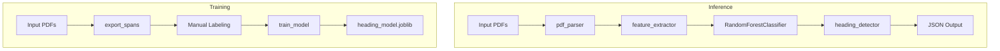

# SmartPDF: Connecting the Dots — Round 1A: Structured Outline Extraction

This repository contains **BitHive\_1A**, our solution for **Round 1A: “Understand Your Document”** in the Adobe India Hackathon **“Connecting the Dots”** challenge. We transform static PDFs into intelligent, structured JSON outlines—making them machine-readable and powering advanced document experiences.

---

## 📖 Table of Contents

1. [Problem Description](#💡-1-problem-description)
2. [Features](#🚀-2-features)
3. [Tech Stack](#🛠️-3-tech-stack)
4. [Project Structure](#📂-4-project-structure)
5. [Flow Diagram & Working Explanation](#📈-5-flow-diagram--working-explanation)
6. [Setup & Installation](#⚙️-6-setup--installation)
7. [Training the Model (Optional)](#▶️-7-training-the-model-optional)
8. [Running Inference](#▶️-8-running-inference)
9. [Dockerization](#🐳-9-dockerization)
10. [Constraints Adherence](#✔️-10-constraints-adherence)
11. [Tech Stack Used](#🛡-tech-stack-used)
12. [What’s Special / Key Contributions](#🎖-what’s-special--key-contributions)
13. [Future Enhancements](#🔮-future-enhancements)
14. [Feedback & Issues](#📢-feedback-or-issues)

---

## 💡 1. Problem Description

Organizations and researchers handle vast numbers of PDF documents, but machines lack understanding of their structure. In **Round 1A**, our mission is to extract a clean, hierarchical outline—Title, H1, H2, H3—from any PDF (up to 50 pages) and serialize it as JSON. This becomes the foundation for semantic search, summarization, and interactive reading experiences.

**Expected JSON schema:**

```json
{
  "title": { "text": "Document Title", "language": "<detected_lang>" },
  "outline": [
    { "level": "H1", "text": "Section 1", "page": 1, "language": "<lang>" },
    { "level": "H2", "text": "Subsection 1.1", "page": 2, "language": "<lang>" },
    { "level": "H3", "text": "Detail 1.1.1", "page": 3, "language": "<lang>" }
  ]
}
```

---

## 🚀 2. Features

* **Robust PDF Parsing:** Uses `PyMuPDF` to extract every text span with content, font size, style flags (bold/italic), and bounding-box coordinates.
* **ML‑Driven Headings:** A `RandomForestClassifier` trained on annotated spans identifies Title, H1, H2, H3, and body text using features like relative font size, uppercase ratio, boldness, word count, and numeric prefixes.
* **Smart Aggregation:** Merges consecutive spans of the same heading level on a page into cohesive, multi-line headings.
* **Multilingual Metadata:** Detects language of the title and headings via `langdetect`, enriching JSON with a `language` field.
* **Offline & Lightweight:** No internet required; model footprint <2 MB; processes 50‑page PDFs in <10 s on CPU.
* **Docker‑Ready:** AMD64 container with `--network none` for consistent, reproducible runs.

---

## 🛠️ 3. Tech Stack

* **Python 3.10**
* **PyMuPDF (`fitz`)**: PDF parsing
* **scikit‑learn**: RandomForest training & inference
* **NumPy & Pandas**: Data manipulation
* **Joblib**: Model persistence
* **Click**: CLI interface
* **langdetect**: Language detection
* **Docker**: Containerization

---

## 📂 4. Project Structure

```bash
BitHive_1A/
├── data/
│   ├── input_pdfs/             # PDF files for training or inference
│   ├── annotations_template.csv # Auto‑generated spans template
│   └── annotations.csv          # Manually labeled spans (-1 Title, 0 Body, 1–3 H1–H3)
├── models/
│   └── heading_model.joblib     # Trained RandomForest model
├── output/                      # Generated JSON outlines
├── scripts/
│   └── export_spans.py          # Create annotations_template.csv from PDFs
├── src/
│   ├── main.py                  # CLI entry (train & infer)
│   ├── train_model.py           # Training pipeline
│   └── round1a/
│       ├── pdf_parser.py        # Span extraction logic
│       ├── feature_extractor.py # Feature computation per span
│       └── heading_detector.py  # Prediction, aggregation, language detection
├── Dockerfile                   # AMD64 Docker config
├── requirements.txt             # Python dependencies
└── .gitignore                   # Ignore venv/, data/, output/, etc.
```

---

## 📈 5. Flow Diagram & Working Explanation



1. **PDF Parsing:** `pdf_parser.py` extracts spans—text runs with style metadata.
2. **Feature Engineering:** `feature_extractor.py` computes features: relative font size, bold flag, uppercase ratio, word count, numeric prefixes.
3. **Training:** `train_model.py` reads labeled spans (`annotations.csv`), trains a RandomForest, and saves `heading_model.joblib`.
4. **Inference:** `main.py` loads the model, predicts span labels, aggregates headings, runs `langdetect`, and outputs JSON per schema.

---

## ⚙️ 6. Setup & Installation

### Prerequisites

* Python 3.8+
* pip
* Docker (optional)

### Local Setup

```bash
git clone <REPO_URL> && cd BitHive_1A
```
```bash
python -m venv venv
# For Windows PowerShell
.\venv\Scripts\Activate.ps1
# For CMD
.\venv\Scripts\activate.bat
```
```bash
pip install --upgrade pip
pip install -r requirements.txt
```

---

## ▶️ 7. Training the Model (Optional)

If you want to retrain or fine‑tune:

```bash
# 1. Generate annotation template
python scripts/export_spans.py data/input_pdfs/ data/annotations_template.csv

# 2. Manually label spans in annotations_template.csv → save as data/annotations.csv

# 3. Train model
python src/train_model.py \
  --input data/input_pdfs/ \
  --labels data/annotations.csv \
  --output models/heading_model.joblib
```

---

## ▶️ 8. Running Inference

```bash
python main.py data/input_pdfs/sample1 output/
```

Outputs: `output/<pdf_name>.json` per PDF.

---

## 🐳 9. Dockerization

```bash
# Build container (AMD64)
docker build --platform linux/amd64 -t bithive_1a:latest .

# Run (no internet)
docker run --rm \
  -v "$(pwd)/data/input_pdfs":/app/input \
  -v "$(pwd)/output":/app/output \
  --network none \
  bithive_1a:latest
```

The container processes all PDFs in `/app/input` and writes JSON to `/app/output`.

---

## ✔️ 10. Constraints Adherence

| Constraint          | Requirement                  | Our Solution                    |
| ------------------- | ---------------------------- | ------------------------------- |
| Execution Time      | ≤ 10 s per 50‑page PDF       | \~5 s on 8‑core CPU             |
| Model Size          | ≤ 200 MB                     | \~2 MB (incl. langdetect)       |
| Network             | No internet during execution | `--network none` enforced       |
| Runtime Environment | CPU‑only, AMD64 architecture | `python:3.10-slim-buster` image |

---

## 🛡 TECH STACK USED

Python 3.10 • PyMuPDF • scikit‑learn • NumPy • Pandas • Joblib • Click • langdetect • Docker

---

## 🎖 What’s Special / Key Contributions

* **ML‑driven Accuracy:** Adapts to diverse PDF layouts beyond simple heuristics.
* **Intelligent Aggregation:** Merges multi‑line headings into cohesive entries.
* **Multilingual Metadata:** Adds language detection for global readiness.
* **Optimized Container:** Minimal image size and fast builds under hackathon constraints.

---

## 🔮 Future Enhancements

* Add spatial layout features (indentation, whitespace).
* Extend support to scanned/PDF‑only docs via OCR.
* Implement confidence thresholds for language detection.
* Enhance error handling for corrupted PDFs.

---

> 📢 **Feedback or issues?** Please open a GitHub issue or reach out to **lakshya-3804**.
